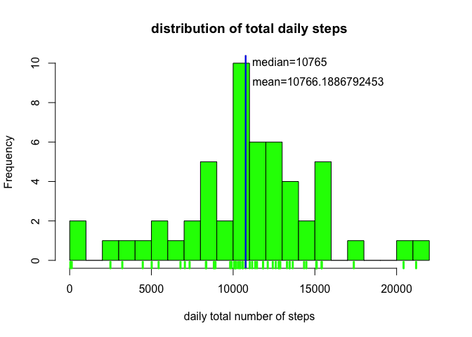
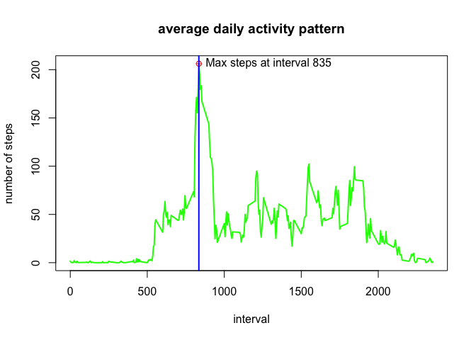
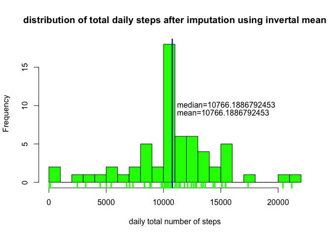
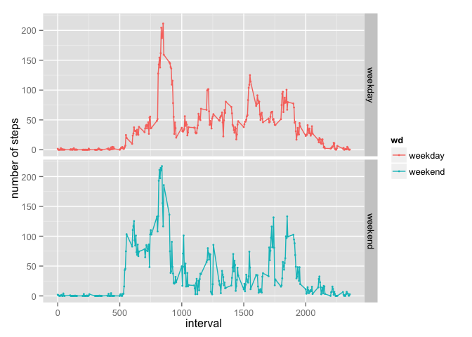

# Reproducible Research: Peer Assessment 1


## Loading and preprocessing the data


```r
library(knitr)
library(data.table)
library(ggplot2)
library(e1071)
act=fread("activity.csv")
act_cplt=act[complete.cases(act),]
opts_chunk$set(echo=TRUE, message=FALSE, warning = FALSE)
set.seed(1000)
```


## What is mean total number of steps taken per day?


```r
act_day=act_cplt[,sum(steps),by=date]
setnames(act_day, "V1", "daily.steps")
hist(act_day$daily.steps, breaks=20, col = "green", 
     xlab = "daily total number of steps", main = "distribution of total daily steps")
rug(act_day$daily.steps, col = "green", lwd=3)
abline(v=mean(act_day$daily.steps), col="black", lwd=2)
abline(v=median(act_day$daily.steps), col="blue", lwd=2)
text(c(mean(act_day$daily.steps),median(act_day$daily.steps)),c(9,10),
     c(paste("mean=",as.character(mean(act_day$daily.steps)),sep=""), 
       paste("median=",as.character(median(act_day$daily.steps)),sep="")), pos = 4)
```

 

The mean of total number of steps taken per day 
is 10766 steps,
and the median is 10765 steps.

## What is the average daily activity pattern?

```r
act_int=act_cplt[,mean(steps),by=interval]
with(act_int, plot(interval, V1, col="green", type='l', 
                   ylab="number of steps", main="average daily activity pattern",lwd=2))
max_int=subset(act_int, V1==max(act_int$V1))$interval
max_step=subset(act_int, V1==max(act_int$V1))$V1
with(act_int, points(max_int, max_step, col="red", pch=10))
text(max_int, max_step, paste("Max steps at interval", max_int), pos=4)
abline(v=max_int, col="blue", lwd=2)
```

 

Interval 835 on average across all the days in the dataset, 
contains the maximum number of steps which is 206.1698113 steps.


## Imputing missing values

```r
na_rows=(1:nrow(act))[!complete.cases(act)]
num_na_rows=length(na_rows)

#impute
for (i in na_rows) {
  act_i=subset(act, interval==act$interval[i])
  act$steps[i]=mean(act_i$steps, na.rm = T)
}

#hist
act_day=act[,sum(steps),by=date]
setnames(act_day, "V1", "daily.steps")
hist(act_day$daily.steps, breaks=20, col = "green", xlab = "daily total number of steps", 
     main = "distribution of total daily steps after imputation using invertal mean")
rug(act_day$daily.steps, col = "green", lwd=3)
abline(v=mean(act_day$daily.steps), col="black", lwd=2)
abline(v=median(act_day$daily.steps), col="blue", lwd=2)
text(c(mean(act_day$daily.steps),median(act_day$daily.steps)),c(9,10),
     c(paste("mean=",as.character(mean(act_day$daily.steps)),sep=""), 
       paste("median=",as.character(median(act_day$daily.steps)),sep="")), pos = 4)
```

 

Total number of missing values in the dataset (i.e. the total number of rows with NAs)
is 2304. Used the mean of the number of steps for one interval across all days
for imputation. After imputation, the new mean and median of daily total number of steps
are 10766 steps and 10766 steps respectively where are almost the same
as before imputation. However, because we used mean for imputation, the data is now 
more concentrated near the mean.


## Are there differences in activity patterns between weekdays and weekends?

```r
act_w=act
new_date=strptime(act_w$date, "%Y-%m-%d")
new_date=weekdays(new_date)
new_date=factor(new_date)
levels(new_date)=c("weekday","weekday","weekday","weekday","weekday","weekend","weekend")
act_w$wd=new_date
act_w=act_w[,mean(steps),by=c("wd","interval")]
setnames(act_w, "V1", "steps")
p=ggplot(act_w, aes(x=interval, y=steps))
p=p+geom_point(size=1, aes(color=wd))+geom_line(aes(color=wd))
p+facet_grid(wd~.)+ylab("number of steps")
```

 

As we can see, on weedays there is a significant peak for activities during a time period
whereas on weekends activities are more evenly distributed.
